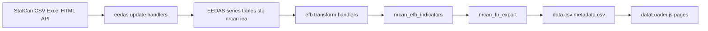

# Data Pipeline Guide

Developer reference for how Factbook data flows from external sources into SQL Server, through indicators, into `public/data/*.csv`, and onto website pages. Use this guide when **adding a new data source** or integrating a new fetch type.

For **day-to-day commands**, see [DATA_UPDATE_GUIDE.md](DATA_UPDATE_GUIDE.md). For **building page UI**, see [PAGE_CREATION_GUIDE.md](PAGE_CREATION_GUIDE.md). For **regenerating the glossary**, see [GLOSSARY_UPDATE_GUIDE.md](GLOSSARY_UPDATE_GUIDE.md).

---

## 1. Pipeline overview

Data moves in three stages: **EEDAS update (raw ingest) → EFB transform (indicators) → export → frontend.**



| Stage | CLI | What gets written |
|-------|-----|-------------------|
| EEDAS update | `python main.py eedas update …` | Publisher-native rows in per-source series tables |
| EFB transform | `python main.py efb transform …` | Semantic Factbook vectors in **`nrcan_efb_indicators`** |
| Export | `python main.py export` | `public/data/data.csv`, `metadata.csv`, `major_projects_map.csv` |

**Key terms:**

- **vector:** Time-series identifier (e.g. `capex_oil_gas`, `oee_neud_R`). Every series in `data.csv` has a unique vector name. Use a **semantic prefix** per source (e.g. `capex_`, `res_`) so the frontend can filter.
- **ref_date:** Reference period, usually a year string (e.g. `"2023"`).
- **value:** Numeric value for that vector and ref_date.

**Key files:**

| Purpose | File |
|--------|------|
| CLI entry point | `scripts/main.py` — `eedas update`, `efb transform`, `export`, `list`, `status`, `test-connection` |
| Section/source config | `scripts/config.yaml` — sections, sources, enabled flags, file paths, StatCan table IDs |
| Config loader | `scripts/config_loader.py` — `is_section_enabled`, `is_source_enabled`, `get_source_config` |
| Section base class | `scripts/sections/base.py` — `update_source`, `transform_source`, `replace_raw_data`, `get_raw_dataframe`, `store_indicators` |
| Database operations | `scripts/db/models.py` — `replace_efb_indicators`, `prepare_export_data`, export getters |
| EEDAS table registry | `scripts/db/eedas_registry.yaml` + `eedas_registry.py` — `source_key` → `source_table` |
| EFB indicator registry | `scripts/db/efb_indicators_registry.yaml` + `efb_registry.py` — dependencies, vector prefixes |
| Schema reference | `scripts/db/README.md`, `scripts/db/setup_database.sql` |
| Export to CSV | `scripts/export/website_files.py` — `prepare_export_data`, write CSVs |
| Source → vector mapping | `scripts/export/source_vectors.py` — `SOURCE_VECTOR_PREFIXES`, `get_vectors_for_source` |
| Frontend data loading | `src/utils/dataLoader.js` — `loadAllData()`, page getters by prefix |

---

## 2. Prerequisites

**SQL Server**

- Create an **empty** database (e.g. `NRCanEnergyFactbook`) matching `config.yaml` / `.env`.
- The first **`python main.py eedas update`** applies DDL from `scripts/db/setup_database.sql` via `ensure_schema.py` (creates missing tables, indexes, procedures).
- You can still run `setup_database.sql` manually in SSMS for a full install including `CREATE DATABASE`.

**Credentials**

- Copy `scripts/.env.example` to `scripts/.env`. Set `DB_SERVER`, `DB_DATABASE`, `DB_USERNAME`, `DB_PASSWORD`, and optionally `EXTERNAL_XLSX_DATA_DIR`.
- Leave username/password empty in `.env` to use Windows Authentication.

**Verify**

```bash
cd scripts
python main.py test-connection
```

---

## 3. Adding a new source (checklist)

Follow these steps to add a new data source and connect it to a page.

### 3.1 Choose the section

Use an existing section (e.g. Section 2 Investment) or add a new section in `config.yaml` and register it in `scripts/main.py` (`SECTION_PROCESSORS`).

### 3.2 Register the source in config

In `scripts/config.yaml`, under the section’s `sources:`, add a new key, e.g. `my_new_source`:

- `enabled: true`
- `description: "Short description"`
- Type-specific config: `statcan_table`, `file_path`, `source_url`, etc.

### 3.3 Register the EEDAS table

In `scripts/db/eedas_registry.yaml`, map `my_new_source` → physical table name (e.g. `stc_my_table`). Add `CREATE TABLE` in `scripts/db/setup_database.sql` if the table is new.

### 3.4 Implement `update_*` (EEDAS ingest)

In the section folder (e.g. `scripts/sections/section2_indicators/my_new_source.py`):

1. Fetch data (StatCan CSV, Excel, HTML, API — see sections 8–13 below).
2. Build **publisher-native** rows — keep StatCan `v*` IDs or publisher dimension keys, not Factbook semantic names yet.
3. Call `processor.replace_raw_data('my_new_source', rows)` or `processor.store_publisher_rows(...)`.
4. Register in the section class: `'my_new_source': update_my_new_source`.

### 3.5 Register and implement `transform_*` (EFB indicators)

In `scripts/db/efb_indicators_registry.yaml`:

- Add `my_new_source` with vector prefix (e.g. `mysource_`) and any dependencies.

In the same source module:

1. Read raw: `df = processor.get_raw_dataframe('my_new_source')`.
2. Aggregate to Factbook vectors (sums, percentages, billions, category buckets).
3. Build `data_rows` as `(semantic_vector, ref_date, value)` and metadata tuples.
4. Call `processor.store_indicators('my_new_source', data_rows, metadata_rows)`.
5. Register: `'my_new_source': transform_my_new_source`.

### 3.6 Export and frontend wiring

1. Add vector prefix in `scripts/export/source_vectors.py`.
2. Add a getter in `src/utils/dataLoader.js` (filter by prefix, group by year).
3. Run all three stages; build or update the page component.

See [PAGE_CREATION_GUIDE.md](PAGE_CREATION_GUIDE.md) for page wiring.

---

## 4. Database layers

| Layer | Table(s) | Written by | Purpose |
|-------|----------|------------|---------|
| **EEDAS raw** | `stc_*`, `nrcan_*`, `iea_*` (per `eedas_registry.yaml`) | `eedas update` | Publisher-native time series |
| **EFB indicators** | `nrcan_efb_indicators` | `efb transform` | Semantic Factbook vectors for the website |
| **Export staging** | `nrcan_fb_export` | `prepare_export_data()` during export | Wide staging table copied to CSV |
| **Registry** | `nrcan_fb_data_sources` | Seeded on first run; updated after successful ingest | Logical sources, sections, `source_url` |
| **Audit** | `nrcan_fb_run_history` | Both stages + export | Per-run status, row counts, errors |
| **Map features** | `nrcan_fb_major_projects_map` | `major_projects_map` update handler | GeoJSON-like rows for map CSV |

Full DDL: [`scripts/db/setup_database.sql`](../scripts/db/setup_database.sql). Overview: [`scripts/db/README.md`](../scripts/db/README.md).

Legacy **`calc_*`**, split export tables, and **`nrcan_fb_s*`** calc tables were removed — aggregation lives in EFB transform handlers, not separate SQL calc tables.

---

## 5. EFB transform: where aggregation happens

All Factbook-specific calculations (NAICS grouping, unit conversion, percentages, cross-source joins) happen in **`transform_*`** handlers in Python.

Pattern:

1. **`update_*`** writes raw rows exactly as the publisher provides them.
2. **`transform_*`** reads those rows, applies business rules, writes semantic vectors to **`nrcan_efb_indicators`** via **`store_indicators`**.

Example: `capital_expenditures.py` — `update_capital_expenditures` stores StatCan rows with NAICS coordinates; `transform_capital_expenditures` groups into `capex_oil_gas`, `capex_electricity`, `capex_total`, etc.

Cross-source transforms read from EEDAS tables populated by other sources (e.g. `economic_contributions` transform may use capex NAICS data already in SQL). They do **not** re-fetch from the web.

---

## 6. Export: from SQL to data.csv and metadata.csv

**`prepare_export_data()`** (`scripts/db/models.py`):

- `DELETE FROM nrcan_fb_export`.
- `INSERT INTO nrcan_fb_export (...) SELECT ... FROM nrcan_efb_indicators`.

**`WebsiteExporter`** (`scripts/export/website_files.py`):

- Calls `repo.prepare_export_data()` (unless workflow skips it).
- Writes **`data.csv`** (`vector, ref_date, value`) and **`metadata.csv`** (`vector`, `title`, `uom`, `scalar_factor`, `source_org`, `source_url`).
- Paths from `config.yaml` (`export.output_dir`, default `../public/data`).

**Selective export** (`--source` or `--vectors`):

- Still runs **`prepare_export_data()`** so staging is current.
- Merges matching vectors into existing files on disk so other vectors are preserved.

**Major projects map:** Written separately from `nrcan_fb_major_projects_map` to `major_projects_map.csv`.

---

## 7. Frontend: how data is fetched for a page

**`src/utils/dataLoader.js`**

- **`loadAllData()`** — fetches `public/data/data.csv`, parses to `{ vector, ref_date, value }[]`.
- **`loadMetadata()`** — fetches `metadata.csv` for titles and units.

**Page-specific getters** (e.g. `getCapitalExpendituresData()`):

- Filter `allData.filter(row => row.vector.startsWith('capex_'))`.
- Group by `ref_date` into one object per year.
- Return sorted array for charts and tables.

See [PAGE_CREATION_GUIDE.md](PAGE_CREATION_GUIDE.md) for using getters in page components.

---

## 8. Source type: StatCan CSV download link

**What it is:** Statistics Canada “download table” CSV with columns such as REF_DATE, VECTOR, VALUE, UOM, SCALAR_FACTOR.

**Getting the URL:** Use the StatCan table viewer download link, or copy the pattern from existing handlers (e.g. `capital_expenditures.py`). Use a **future end date** so new StatCan releases are included.

**In `update_*`:**

- Call `processor.fetch_csv_from_url(url)` (from `base.py`).
- Parse with pandas; find columns case-insensitively via `get_column`.
- Store publisher-native rows with **`replace_raw_data`** or **`store_publisher_rows`** (StatCan vector IDs, not semantic names).

**In `transform_*`:**

- Read raw: `get_raw_dataframe('source_key')`.
- Filter, group by year and category (NAICS, etc.), compute totals and derived series.
- Build semantic `(vector, ref_date, value)` tuples; call **`store_indicators`**.

**Example:** [`scripts/sections/section2_indicators/capital_expenditures.py`](../scripts/sections/section2_indicators/capital_expenditures.py) — `update_capital_expenditures` + `transform_capital_expenditures`.

---

## 9. Source type: StatCan WDS (JSON) API

**URL pattern:** `https://www150.statcan.gc.ca/t1/wds/rest/getDataFromVectorByReferencePeriodRange?vectorIds=...&startRefPeriod=...&endReferencePeriod=...`

**In `update_*`:** Use **`fetch_wds_vector_data(vector_ids, start_ref, end_ref)`** from `base.py`. Store raw `(vector_id, ref_per, value)` rows.

**In `transform_*`:** Map StatCan vector IDs to semantic names; build indicator rows; call **`store_indicators`**.

---

## 10. Source type: Local Excel file

**Config:** Set `file_path` or section-specific keys (`seu_final_demand_file_path`, `ee_improvement_file_path`, etc.) in `config.yaml`. Paths resolve via `EXTERNAL_XLSX_DATA_DIR` or repo root ([`scripts/xlsx_paths.py`](../scripts/xlsx_paths.py)).

**In `update_*`:**

- Resolve path; check `path.exists()`; log and return 0 if missing.
- `pd.read_excel(path, sheet_name=...)`.
- Store publisher row labels and values with **`replace_raw_data`**.

**In `transform_*`:**

- Read raw dataframe; map row labels to semantic vectors (e.g. `res_ter`, `seu_natural_gas`).
- Call **`store_indicators`**.

**Examples:** [`seu.py`](../scripts/sections/section4_indicators/seu.py), residential handlers in [`residential.py`](../scripts/sections/section4_indicators/residential.py).

---

## 11. Source type: Excel from URL or ZIP

**In `update_*`:**

- `requests.get(url)` → if ZIP, extract `.xls`/`.xlsx` with `zipfile`.
- Parse with pandas (`engine='xlrd'` for `.xls`).
- Store raw sector/year rows (e.g. OEE NEUD per sector R, C, I, T, A).

**In `transform_*`:**

- Merge sectors; add Primary Energy Use Demand from a separate raw source if needed.
- Build `oee_neud_*` vectors; call **`store_indicators`**.

**Example:** [`energy_use.py`](../scripts/sections/section4_indicators/energy_use.py) + [`_oee.py`](../scripts/sections/section4_indicators/_oee.py).

---

## 12. Source type: Online HTML tables

**In `update_*`:**

- `requests.get(url)` → BeautifulSoup → parse `<table>` rows.
- Store row labels and year columns as publisher-native dimension keys.

**In `transform_*`:**

- Map labels to semantic vectors (`res_ter`, `res_space_heating_pj`, etc.).
- Call **`store_indicators`**.

**Example:** [`_oee.py`](../scripts/sections/section4_indicators/_oee.py) for OEE Residential Analysis HTML.

---

## 13. Source type: External API (REST or ArcGIS)

**In `update_*`:**

- Fetch JSON from configured `source_url`.
- **Time series:** store raw API fields with **`replace_raw_data`**.
- **Map/feature data:** map attributes to schema; call dedicated repo method (e.g. **`insert_major_projects_map`**).

**In `transform_*`:**

- Aggregate time-series API responses to semantic vectors if needed.
- Map data may skip transform — export reads the map table directly.

**Example:** `major_projects_map` — ArcGIS Feature Server → `nrcan_fb_major_projects_map` → `major_projects_map.csv`.

---

## 14. Metadata and units

Per-vector attribution lives on indicator rows (and thus in export staging): **title**, **uom**, **scalar_factor**, **source_org**, **source_url**.

**`store_indicators`** expects metadata tuples of **(vector, title, uom, scalar_factor, source_org, source_url)**. Prefer supplying all six for consistent glossary and exports.

The registry table **`nrcan_fb_data_sources`** stores a canonical **`source_url`** per logical `source_key` for the data gallery.

---

## 15. Data loader: adding a new getter

In `src/utils/dataLoader.js`:

1. Add an exported async function, e.g. `getMySourceData()`.
2. `const allData = await loadAllData()`.
3. Filter: `allData.filter(row => row.vector && row.vector.startsWith('mysource_'))`.
4. Group by `ref_date` into year objects.
5. Return sorted array.

**Existing getters and prefixes (summary):**

| Prefix(es) | Getter | Source(s) |
|------------|--------|-----------|
| capex_ | getCapitalExpendituresData | capital_expenditures |
| infra_ | getInfrastructureData | infrastructure |
| econ_ | getEconomicContributionsData | economic_contributions |
| asset_ | getInvestmentByAssetData | investment_by_asset |
| intl_ | getInternationalInvestmentData | international_investment |
| foreign_ | getForeignControlData | foreign_control |
| enviro_ | getEnvironmentalProtectionData | environmental_protection |
| gdp_prov_ | getProvincialGdpData | provincial_gdp |
| projects_ | getMajorProjectsData | major_projects |
| cleantech_ | getCleanTechTrendsData | clean_tech |
| gdp_nominal_ | getNominalGDPData | nominal_gdp |
| cea_ | getCEAData | canadian_energy_assets |
| energy_prod_ | getWorldEnergyProductionData | world_energy_production |
| ghg_ | getGHGEmissionsData | ghg_emissions |
| envcleantech_ | getEnvironmentalCleanTechData | environmental_clean_tech |
| oee_neud_ | getEnergyUseData | energy_use |
| seu_ | getSEUByFuelData | seu_by_fuel |
| res_ | getEnergyInDailyLivesResidentialData, getResidentialEnergyUseData | residential_daily_lives, residential_pie_charts |
| com_ | getCommercialInstitutionalEnergyUseData | commercial_institutional |

See `dataLoader.js` for the full list.

---

## 16. Trace an indicator to a page

1. **Find the vector** in `public/data/data.csv` (e.g. `capex_oil_gas`).
2. **Identify the source key** from the prefix in [`source_vectors.py`](../scripts/export/source_vectors.py) (`capex_` → `capital_expenditures`).
3. **Find handlers** in the matching section folder (`update_*` + `transform_*`).
4. **Find the getter** in `dataLoader.js`.
5. **Find the page** — grep the getter in `src/pages/`.
6. **Find the section anchor** — grep the component name in `Section*.jsx`.

**Worked example:**

```
config.yaml → capital_expenditures (section2_indicators)
  ↓
section2_indicators/capital_expenditures.py
  update_capital_expenditures → transform_capital_expenditures
  ↓
nrcan_efb_indicators → export → data.csv (capex_*)
  ↓
dataLoader.js → getCapitalExpendituresData()
  ↓
Investment.jsx, CapitalExpenditures.jsx → SectionTwo.jsx (#capital-expenditure)
```

Page-by-page maps: [`scripts/sections/section*_indicators/README.md`](../scripts/sections/).

---

## 17. Troubleshooting

| Symptom | First step |
|---------|------------|
| Pipeline exit code `1` | `python main.py status --failed-only`; read latest log in `scripts/logs/` |
| Transform returns 0 rows | Check EEDAS update succeeded; inspect raw table; verify transform reads correct columns |
| Page shows no data after export | Confirm vector prefix matches in handler, `source_vectors.py`, and dataLoader getter |
| StatCan returns HTML | Check URL dates and selectedMembers; try alternative download endpoint |
| Excel parse fails | Confirm sheet name and anchor text; use `header=None` and search by cell value |
| Selective export | Merges only matching vectors; other sources' vectors remain on disk |

Full operator guide: [DATA_UPDATE_GUIDE.md — Troubleshooting](DATA_UPDATE_GUIDE.md#troubleshooting).

---

## 18. Reference summary

| Section | Config key | Package | Example sources | Vector prefixes |
|---------|------------|---------|-----------------|-----------------|
| Key Indicators | section1_indicators | [`section1_indicators/`](../scripts/sections/section1_indicators/) | economic_contributions, provincial_gdp, canadian_energy_assets, ghg_emissions | econ_, gdp_prov_, cea_, ghg_ |
| Investment | section2_indicators | [`section2_indicators/`](../scripts/sections/section2_indicators/) | capital_expenditures, infrastructure, major_projects | capex_, infra_, projects_ |
| Energy Efficiency | section4_indicators | [`section4_indicators/`](../scripts/sections/section4_indicators/) | energy_use, seu_by_fuel, residential_* | oee_neud_, seu_, res_, com_ |
| Clean Power | section5_indicators | [`section5_indicators/`](../scripts/sections/section5_indicators/) | environmental_clean_tech, ev_sales | envcleantech_ |
| Oil, Gas and Coal | section6_indicators | [`section6_indicators/`](../scripts/sections/section6_indicators/) | rpp_supply_demand, crude_prices, oil_sands | rpp_, crude_, os_ |

**Cross-references:**

- **Commands:** [DATA_UPDATE_GUIDE.md](DATA_UPDATE_GUIDE.md)
- **Page UI:** [PAGE_CREATION_GUIDE.md](PAGE_CREATION_GUIDE.md)
- **Deployment:** [DEPLOYMENT.md](DEPLOYMENT.md)
- **Client Q&A:** [EFB_MODERNIZATION_REVIEW.md](EFB_MODERNIZATION_REVIEW.md)
