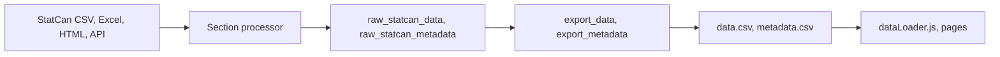

# Data Pipeline Guide

This guide explains how to add and maintain data sources for the NRCan Energy Factbook so that data flows from the source (StatCan, Excel, HTML tables, APIs) into SQL Server, then into `data.csv` and `metadata.csv`, and finally to the website pages. Use it when adding a **new page** that needs a new data source or when integrating a new type of source.

For **quick commands** (refresh, export, list), see [DATA_UPDATE_GUIDE.md](DATA_UPDATE_GUIDE.md). For **building the page UI** (charts, tables, download), see [PAGE_CREATION_GUIDE.md](PAGE_CREATION_GUIDE.md). For **regenerating the glossary viewer** (`public/glossary/`), see [GLOSSARY_UPDATE_GUIDE.md](GLOSSARY_UPDATE_GUIDE.md).

---

## 1. Pipeline Overview and Data Flow

Data moves in one direction: **sources → section processors (fetch, parse, calculate) → SQL Server → export tables → CSV files → frontend.**



- **Sources:** StatCan CSV download links, StatCan WDS (JSON) API, local Excel files, Excel from URL/ZIP, online HTML tables, external REST/ArcGIS APIs.
- **Section processor:** A Python class (e.g. `Section2Investment`) that defines one handler per source. Each handler fetches data, parses it, optionally calculates aggregates, and writes to the database.
- **SQL Server:** `raw_statcan_data` holds every (vector, ref_date, value) row; `raw_statcan_metadata` holds (vector, title, uom, scalar_factor, source_org, source_url). Optional `calc_*` tables store normalized per-year records; the **export** still reads only from `raw_statcan_*` (via the export tables).
- **Export:** The export step runs `prepare_export_data()`, which copies `raw_statcan_data` → `export_data` and `raw_statcan_metadata` → `export_metadata`, then writes `export_data` and `export_metadata` to `public/data/data.csv` and `public/data/metadata.csv` (with optional filters by source or vector pattern).
- **Frontend:** `dataLoader.js` fetches `data/data.csv`, parses it, and exposes getters (e.g. `getCapitalExpendituresData()`) that filter by vector prefix and reshape rows into arrays of per-year objects. Pages call these getters and use the data in charts and tables.

**Terms:**

- **vector:** Time-series identifier (e.g. `capex_oil_gas`, `oee_neud_R`). Every series in `data.csv` has a unique vector name. Use a **semantic prefix** per source (e.g. `capex_`, `res_`) so the frontend can filter.
- **ref_date:** Reference period, usually a year string (e.g. `"2023"`).
- **value:** Numeric value for that vector and ref_date.

**Key files:**

| Purpose | File |
|--------|------|
| CLI entry point | `scripts/main.py` – refresh (--all, --section, --source), export, list, test-connection |
| Section/source config | `scripts/config.yaml` – sections, sources, enabled flags, file paths, StatCan table IDs |
| Config loader | `scripts/config_loader.py` – is_section_enabled, is_source_enabled, get_source_config |
| Section base class | `scripts/sections/base.py` – get_source_handlers, refresh_all/refresh_source, fetch_csv_from_url, store_raw_data, extract_data_and_metadata |
| Database operations | `scripts/db/models.py` – insert_raw_statcan_data, insert_raw_statcan_metadata, upsert_calc_*, prepare_export_data, get_export_data/get_export_metadata |
| Export to CSV | `scripts/export/website_files.py` – prepare_export_data, write data.csv and metadata.csv (with optional source/vector filters) |
| Source → vector mapping | `scripts/export/source_vectors.py` – SOURCE_VECTOR_PREFIXES, get_vectors_for_source |
| Frontend data loading | `src/utils/dataLoader.js` – loadAllData(), getXxxData() by prefix |

---

## 2. Prerequisites: SQL Server, Config, and .env

**SQL Server**

- SQL Server must be running. Create the database and tables by running `scripts/db/setup_database.sql` (creates database `NRCanEnergyFactbook`, tables: `data_sources`, `run_history`, `raw_statcan_data`, `raw_statcan_metadata`, `calc_*`, `export_data`, `export_metadata`, `raw_major_projects_map`, etc.).

**Credentials**

- Copy `scripts/.env.example` to `scripts/.env`. Set `DB_SERVER`, `DB_DATABASE`, `DB_USERNAME`, `DB_PASSWORD`. Or leave username/password empty in `config.yaml` to use Windows Authentication.
- Config is in `scripts/config.yaml`; database section can be overridden by environment variables (see config_loader).

**Verify**

- From the `scripts/` directory run: `python main.py test-connection`. This confirms the database is reachable.

**Config structure**

- `config.yaml` has a `sections` block. Each section (e.g. `section2_investment`) has `enabled`, `name`, and `sources`. Each source has `enabled`, `description`, and type-specific keys: `statcan_table`, `file_path`, `source_url`, `oee_neud_file_path`, etc., depending on how the source is fetched.

---

## 3. Adding a New Source for a New Page (Checklist)

Follow these steps to add a new data source and connect it to a page.

**1. Choose the section**

- Use an existing section (e.g. Section 2 Investment) or add a new section in `config.yaml` and a new processor in `scripts/sections/` (and register it in `scripts/main.py` in `SECTION_PROCESSORS`).

**2. Register the source in config**

- In `scripts/config.yaml`, under the section’s `sources:`, add a new key, e.g. `my_new_source`:
  - `enabled: true`
  - `description: "Short description"`
  - Type-specific config: `statcan_table`, `file_path`, `source_url`, etc., as required by the handler.

**3. Implement the handler in the section processor**

- In the section’s Python file (e.g. `scripts/sections/section2_investment.py`):
  - Add a method, e.g. `_process_my_new_source(self) -> int`.
  - Inside it: (a) fetch data (using one of the patterns in sections 8–13 below), (b) normalize to lists of `(vector, ref_date, value)` and metadata tuples, (c) call `self.store_raw_data('my_new_source', data_rows, metadata_rows)`.
  - Return the number of rows stored.
  - In `get_source_handlers()`, add: `'my_new_source': self._process_my_new_source`.

**4. Use semantic vector names and register the prefix**

- All vectors written to `raw_statcan_data` must use a **consistent prefix** (e.g. `mysource_`) so the frontend can filter. In `scripts/export/source_vectors.py`, add to `SOURCE_VECTOR_PREFIXES`: `'my_new_source': ['mysource_']`. Optionally add to `SOURCE_DISPLAY_NAMES`.

**5. Run refresh and export**

- `cd scripts` then:
  - `python main.py refresh --source my_new_source`
  - `python main.py export`
  - Or: `python main.py refresh --source my_new_source --export-after`
- For selective export only: `python main.py export --source my_new_source` (merges this source’s vectors into existing data.csv/metadata.csv).

**6. Add a frontend getter**

- In `src/utils/dataLoader.js`, add an exported async function, e.g. `getMyNewSourceData()`, that:
  - Calls `const allData = await loadAllData()`
  - Filters: `allData.filter(row => row.vector && row.vector.startsWith('mysource_'))`
  - Groups by `row.ref_date` into one object per year, mapping vector suffix to keys
  - Returns `Object.values(yearMap).sort((a, b) => a.year - b.year)` (coerce year to number for sorting if needed).

**7. Use the getter on the page**

- In the page component, call the getter in `useEffect`, set state, and use the data in charts/tables (see [PAGE_CREATION_GUIDE.md](PAGE_CREATION_GUIDE.md)).

**Minimal code example (single vector per year)**

Handler (conceptual):

```python
def _process_my_new_source(self) -> int:
    # Fetch: e.g. df = self.fetch_csv_from_url(url)
    data_rows = []
    for year, value in ...:  # your (year, value) pairs
        data_rows.append(('mysource_total', str(year), round(value, 2)))
    metadata_rows = [
        ('mysource_total', 'My indicator', 'Units', 'units', 'Source Org', 'https://...'),
    ]
    return self.store_raw_data('my_new_source', data_rows, metadata_rows)
```

DataLoader getter:

```javascript
export async function getMyNewSourceData() {
    const allData = await loadAllData();
    const filtered = allData.filter(row => row.vector && row.vector.startsWith('mysource_'));
    const yearMap = {};
    filtered.forEach(row => {
        const year = row.ref_date;
        if (!yearMap[year]) yearMap[year] = { year: Number(year) };
        yearMap[year][row.vector.replace('mysource_', '')] = row.value;
    });
    return Object.values(yearMap).sort((a, b) => a.year - b.year);
}
```

---

## 4. SQL Server: Tables and How Data Gets There

| Table | Purpose | When it is written |
|-------|--------|--------------------|
| **data_sources** | Registry of source_key, section_id, last_refresh_at | Updated by `repo.update_source_last_refresh(source_key)` after a successful refresh. |
| **run_history** | Audit log (source_key, run_type, status, rows_affected, error_message) | `repo.log_run_start` at start of handler; `repo.log_run_complete` on success/failure. |
| **raw_statcan_data** | (vector, ref_date, value, source_key) | Written by handlers via `store_raw_data` or `repo.insert_raw_statcan_data`. Holds both raw StatCan vectors (v123...) and semantic vectors (capex_*, oee_neud_*, etc.). **All data that appears in data.csv must be in this table.** |
| **raw_statcan_metadata** | (vector, title, uom, scalar_factor, source_org, source_url, source_key) | Written by handlers via `store_raw_data` or `repo.insert_raw_statcan_metadata`. One row per vector. |
| **calc_*** | Normalized per-year records (e.g. calc_capital_expenditures: ref_year, oil_gas, electricity, other_energy, total) | Written by handlers via `repo.upsert_capital_expenditures(calc_data)` (or equivalent). Used for querying; **export does not read these**—only raw_statcan_data is copied to export_data. |
| **export_data** / **export_metadata** | Copy of raw_statcan_data and raw_statcan_metadata | Filled by `prepare_export_data()` (DELETE then INSERT from raw_*). The exporter reads these tables to write data.csv and metadata.csv. |

Full schema: `scripts/db/setup_database.sql`.

---

## 5. Calculations: Where and How They Are Stored

- **All calculations** for pipeline-sourced series are done **in the section handler** in Python (e.g. sums by NAICS, conversion to billions, percentages). The frontend does not recalculate these from raw vectors; it may do small derivations (e.g. “energy use excluding EE effect” from two vectors).

- **Two storage patterns:**
  1. **Semantic vectors only:** Build `data_rows` as a list of `(vector, ref_date, value)` with names like `capex_oil_gas`, `capex_total_billions`, and call `store_raw_data(source_key, data_rows, metadata_rows)`. No calc_* table.
  2. **Calc table + semantic vectors:** For structured per-year records, (1) build a list of dicts and call `self.repo.upsert_capital_expenditures(calc_data)` (or the matching upsert for that domain), and (2) also build `data_rows` with the same semantic vectors and call `store_raw_data(...)` so the export has the vectors. Example: capital_expenditures in `scripts/sections/section2_investment.py` does both.

- **Important:** The export step reads only from `raw_statcan_data` (via `prepare_export_data`). Any value that should appear in data.csv must be written to `raw_statcan_data` with the desired vector name. Writing only to a calc_* table is not enough for the website.

---

## 6. Export: From SQL to data.csv and metadata.csv

**prepare_export_data()** (`scripts/db/models.py`)

- Clears `export_data` and `export_metadata`.
- Inserts all rows from `raw_statcan_data` into `export_data` (vector, ref_date, value).
- Inserts all rows from `raw_statcan_metadata` into `export_metadata` (vector, title, uom, scalar_factor, source_org, source_url).

**WebsiteExporter.export_all()** (`scripts/export/website_files.py`)

- Calls `repo.prepare_export_data()`.
- Calls `_export_data_csv()` and `_export_metadata_csv()`. Output directory and filenames come from config: `export.output_dir` (e.g. `../public/data`), `export.files.data_csv`, `export.files.metadata_csv`.

**Selective export** (`--source` or `--vectors`)

- When a filter is set, the exporter still runs `prepare_export_data()` (so export_data contains everything from raw_statcan_data). For **data.csv**: it loads the **existing** data.csv from disk (if present), then **merges** into it only the rows from export_data that match the source’s vector prefixes (or the vector pattern). So existing vectors from other sources stay; only the selected source’s vectors are updated. Same idea for **metadata.csv**: merge with existing file by vector.
- So: full export overwrites data.csv/metadata.csv with the full DB content. Selective export updates only the matching vectors in the existing files.

**File format**

- **data.csv:** Header: `vector,ref_date,value`. One row per (vector, ref_date, value).
- **metadata.csv:** Columns: vector, title, uom, scalar_factor, source_org, source_url (if present in export_metadata).

---

## 7. Frontend: How Data Is Fetched for a Page

- **loadAllData()** in `src/utils/dataLoader.js`: Fetches `${BASE_URL}data/data.csv` (BASE_URL from Vite), parses CSV with a simple parser, caches in memory. Returns an array of objects `{ vector, ref_date, value }` (value may be parsed as number).

- **Page-specific getters** (e.g. `getCapitalExpendituresData()`): Filter `allData.filter(row => row.vector.startsWith('capex_'))`, group by `ref_date` into one object per year, map vector suffix to property (e.g. `capex_oil_gas` → `yearMap[year].oil_gas = row.value`), return `Object.values(yearMap).sort((a, b) => a.year - b.year)`.

- **Using the getter on a page:** In the page component, call the getter in `useEffect`, set state (e.g. `setPageData(data)`), and use that state for the chart and table. See [PAGE_CREATION_GUIDE.md](PAGE_CREATION_GUIDE.md).

---

## 8. Source Type: StatCan CSV Download Link

**What it is**

- Statistics Canada “download table” CSV. The URL points to a CSV with columns such as REF_DATE, VECTOR (or Coordinate), VALUE, UOM, SCALAR_FACTOR. The URL includes table ID (pid), startDate, endDate, selectedMembers (dimension members), and checkedLevels.

**Getting the URL**

- Use the StatCan table viewer for the table (e.g. 34-10-0036-01). Use “Download” / “Download table” and copy the download link. Or build the URL from the same pattern used in the codebase: see `scripts/data_retrieval.py` (e.g. `get_capital_expenditures_url`) and `scripts/sections/section2_investment.py` (e.g. `_get_capital_expenditures_url`). Use a **future end date** (e.g. today + 2 years) so that when StatCan publishes new data, it is included.

**Fetching**

- In the section processor, call `self.fetch_csv_from_url(url)`. The base implementation in `scripts/sections/base.py` uses `requests.get`, checks for HTML or “Failed to get” in the response body, and parses with `pd.read_csv(io.StringIO(text))`. It can try an alternative URL (downloadDbLoadingData-nonTraduit.action) if the first fails.

**Parsing**

- Find columns case-insensitively with `self.get_column(df, 'REF_DATE', 'Ref_date', 'ref_date')` and similarly for VALUE, VECTOR, etc.
- **Option A – Generic:** Use `self.extract_data_and_metadata(df, source_key)` to get (data_rows, metadata_rows) in StatCan’s native vector format, then store with `insert_raw_statcan_data` for a different source_key if you want to keep raw vectors. For the **website** you usually want semantic names, so Option B is typical.
- **Option B – Custom:** Filter rows (e.g. where “Capital expenditures” is selected), group by year and category (e.g. NAICS), compute totals and derived series (percentages, billions). Build `data_rows` as a list of tuples `(semantic_vector, str(year), value)` (e.g. `capex_oil_gas`, `capex_total`, `capex_total_billions`) and `metadata_rows` as list of `(vector, title, uom, scalar_factor, source_org, source_url)`. Call `self.store_raw_data('capital_expenditures', data_rows, metadata_rows)`. If you also use a calc_* table, call `self.repo.upsert_capital_expenditures(calc_data)` with the same data in structured form.

**Example**

- Capital expenditures: `scripts/sections/section2_investment.py`, method `_process_capital_expenditures`. It builds the URL, fetches CSV, filters to “Capital expenditures”, groups by year and NAICS (oil/gas, electricity, other), computes total and percentages and billions, builds data_rows and metadata_rows, calls `upsert_capital_expenditures(calc_data)` and `store_raw_data('capital_expenditures', data_rows, metadata_rows)`.

---

## 9. Source Type: StatCan WDS (JSON) API

**What it is**

- StatCan Web Data Services: `getDataFromVectorByReferencePeriodRange`. Returns JSON with vectorId and vectorDataPoint (refPer, value).

**URL pattern**

- `https://www150.statcan.gc.ca/t1/wds/rest/getDataFromVectorByReferencePeriodRange?vectorIds=...&startRefPeriod=...&endReferencePeriod=...`. Vector IDs are numeric; you can pass with or without a “v” prefix (the base class normalizes them).

**Fetching**

- Use the base class method **fetch_wds_vector_data(vector_ids, start_ref, end_ref)** in `scripts/sections/base.py`. It returns a list of `(vector_id, ref_per, value)`. ref_per can be YYYY or YYYY-MM-DD.

**Mapping to semantic vectors**

- Keep a mapping of StatCan vector ID → your vector name (e.g. NRSA_VECTORS in `scripts/data_retrieval.py`). For each (vid, ref_per, value), derive the year from ref_per (e.g. take first four characters), look up the semantic name (e.g. `mysource_oil_extraction`), append `(semantic_vector, year_str, value)` to data_rows. Build metadata_rows for each semantic vector. Call **store_raw_data(source_key, data_rows, metadata_rows)**.

---

## 10. Source Type: Local Excel File

**Config**

- In `config.yaml`, under the source, set a path key. Either a generic `file_path: "Filename.xlsx"` (document whether it’s relative to scripts dir or project root) or a specific key like `seu_final_demand_file_path` or `ee_improvement_file_path` as in Section 4. Resolve the path in the handler relative to a known base (e.g. script dir or project root).

**Resolving the path**

- In the handler, read the path from the section’s source config. If relative, join with a base directory. Check `path.exists()` before proceeding; if missing, log a clear message and return 0.

**Reading**

- Use `pd.read_excel(path, sheet_name=...)`. sheet_name can be an index (0), a sheet name string, or a list of sheets. For flexible layouts, iterate sheets with `header=None` and search for a header row (e.g. a row containing year numbers) and a first column with row labels. Match row labels (e.g. “Total Energy Use (PJ)”, “Space Heating”) to your vector names (e.g. ter, space_heating_pj).

**Building data_rows**

- For each (year, vector) with a value, append `(prefix + vector_name, str(year), value)` to data_rows. Use a consistent prefix (e.g. res_, seu_). Build metadata_rows. Call **store_raw_data(source_key, data_rows, metadata_rows)**.

**Examples**

- SEU by fuel: `scripts/sections/section4_indicators.py`, `_process_seu_by_fuel`. Resolves path to “SEU Final Demand.xlsx” (or config path), reads sheet “SEU (final demand)”, finds year columns and fuel rows, aggregates by category, builds `seu_*` vectors, calls `store_raw_data('seu_by_fuel', ...)`.
- Residential daily lives: EE Improvement.xlsx, sheet “Residential”; column names or row labels mapped to res_ter, res_eee, res_space_heating_pj, etc., and stored with prefix `res_`.

---

## 11. Source Type: Excel from URL or ZIP

**Download**

- `response = requests.get(url, timeout=...)` → `content = response.content`. If the URL is a ZIP, use `zipfile.ZipFile(io.BytesIO(content), 'r')`, then `zf.namelist()` to find the .xls or .xlsx file, and `zf.read(name)` to get the Excel bytes.

**Parse**

- Use `pd.ExcelFile(io.BytesIO(excel_bytes), engine='xlrd')` for .xls. Read the relevant sheet(s) with `pd.read_excel(xls, sheet_name=..., header=None)`. Locate an anchor (e.g. “Total Energy Use (PJ)”) to find the data row and year columns. Extract years from header cells and values from the data row; same row-label → vector mapping as for local Excel.

**Example**

- OEE NEUD: `scripts/sections/section4_indicators.py`. OEE_NEUD_ZIP_URLS per sector (R, C, I, T, A). `_fetch_sector_xls_from_zip` downloads the ZIP, extracts the single .xls file. `_parse_oee_sector_xls` finds the “Total Energy Use (PJ)” row and year columns, returns `{year: total_pj}` per sector. Results are merged with Primary Energy Use Demand (local Excel) to build full vectors (R, C, I, T, A, P, NPC, FK, EL); then `store_raw_data('energy_use', data_rows, metadata_rows)` and optionally `upsert_energy_use(calc_data)`.

---

## 12. Source Type: Online HTML Tables

**Fetch**

- `response = requests.get(table_url)`; `html = response.text`.

**Parse**

- Use BeautifulSoup: `soup = BeautifulSoup(html, 'html.parser')`, find `<table>`, get `<tr>` rows. Use the first row (or first two) for headers; map header cells to year columns (parse year from cell text). For each data row, read the first cell as the row label (e.g. “Total Energy Use (PJ)”) and map it to a vector name; for each year column index, read the cell, convert to float (handle commas and minus signs), and append (vector, year, value) to data_rows.

**Normalize**

- Strip and lowercase labels for matching. Handle “Total Energy Use (PJ)”, “Energy efficiency effect”, etc. Build metadata_rows. Call **store_raw_data(source_key, data_rows, metadata_rows)**.

**Example**

- OEE Residential Analysis HTML: `scripts/sections/section4_indicators.py`, `_parse_oee_residential_analysis_html`. Parses the table, finds year columns from the first row, matches row labels to ter, eee, space_heating_pj, water_heating_pj.

---

## 13. Source Type: External API (REST or ArcGIS)

**Config**

- In config, set e.g. `source_type: "api"`, `source_url: "https://..."`. Add any required keys (api_key, layer id, etc.).

**Fetch**

- `response = requests.get(url, params=...)` or `requests.post` if required. `data = response.json()`.

**Transform**

- **Time series:** Map the API response to (vector, ref_date, value). Build data_rows with semantic vectors and call **store_raw_data**.
- **Map/feature data:** If the API returns features (e.g. GeoJSON or ArcGIS Feature Server), map attributes to a fixed schema (company, project_name, province, lat, lon, etc.) and call a dedicated repository method, e.g. **repo.insert_major_projects_map(rows)**. The export step then writes a separate CSV (e.g. major_projects_map.csv) from that table via `get_major_projects_map_for_export()`.

**Example**

- Major projects map: ArcGIS Feature Server URL; fetch features, map attributes to columns; `repo.insert_major_projects_map(rows)`; export writes `major_projects_map.csv` from the same repo method.

---

## 14. Metadata and Units

- **raw_statcan_metadata** (and export_metadata) stores: vector, title, uom, scalar_factor, source_org, source_url. **title** = human-readable description; **uom** = unit of measure (e.g. “Millions of dollars”, “PJ”); **scalar_factor** = e.g. “millions”, “billions”; **source_org** and **source_url** for attribution.

- When calling **store_raw_data**, pass **metadata_rows** as a list of tuples. The repository expects **6 elements**: (vector, title, uom, scalar_factor, source_org, source_url). If you only have 4 (vector, title, uom, scalar_factor), the code pads with None for source_org and source_url (see `scripts/db/models.py`, insert_raw_statcan_metadata: `row[4] if len(row) > 4 else None`). So 4-element tuples work.

---

## 15. Data Loader: Adding a New Getter

In `src/utils/dataLoader.js`:

1. Add an exported async function, e.g. `getMySourceData()`.
2. `const allData = await loadAllData()`.
3. Filter: `allData.filter(row => row.vector && row.vector.startsWith('mysource_'))`.
4. Group by ref_date: for each row, ensure `yearMap[row.ref_date]` exists (e.g. `{ year: Number(row.ref_date) }`), then set `yearMap[row.ref_date][row.vector.replace('mysource_', '')] = row.value`.
5. Return `Object.values(yearMap).sort((a, b) => a.year - b.year)`. Coerce year to number for sorting if ref_date is a string.

**Existing getters and prefixes (summary)**

| Prefix(es) | Getter | Source(s) |
|------------|--------|-----------|
| capex_ | getCapitalExpendituresData | capital_expenditures |
| infra_ | getInfrastructureData | infrastructure |
| econ_ | getEconomicContributionsData | economic_contributions |
| asset_ | getInvestmentByAssetData | investment_by_asset |
| intl_ | getInternationalInvestmentData | international_investment |
| foreign_ | getForeignControlData | foreign_control |
| enviro_ | getEnvironmentalProtectionData | environmental_protection |
| gdp_prov_ | getProvincialGdpData | provincial_gdp |
| projects_ | getMajorProjectsData | major_projects |
| cleantech_ | getCleanTechTrendsData | clean_tech |
| gdp_nominal_ | getNominalGDPData | nominal_gdp |
| cea_ | getCEAData | canadian_energy_assets |
| energy_prod_ | getWorldEnergyProductionData | world_energy_production |
| ghg_ | getGHGEmissionsData | ghg_emissions |
| envcleantech_ | getEnvironmentalCleanTechData | environmental_clean_tech |
| oee_neud_ | getEnergyUseData | energy_use |
| seu_ | getSEUByFuelData | seu_by_fuel |
| res_ | getPage50ResidentialData, getPage51Data | residential_daily_lives, residential_pie_charts |
| com_ | getPage52Data | commercial_institutional |

(Other getters may use the same or composite data; see dataLoader.js for the full list.)

---

## 16. Troubleshooting and Common Pitfalls

- **Refresh succeeds but the page shows no data:** Run **export** after refresh (`python main.py export` or `--export-after`). Ensure the **vector prefix** in `source_vectors.py` matches what the handler writes and what the dataLoader getter filters on (e.g. `mysource_` everywhere).

- **StatCan URL returns HTML or “Failed to get”:** Check the URL (dates, selectedMembers, table id). Try the alternative endpoint (downloadDbLoadingData-nonTraduit.action). Check for rate limiting or temporary StatCan errors.

- **Excel parse fails:** Confirm sheet name and that the header row and anchor text (e.g. “Total Energy Use”) exist. Use `header=None` and search by cell value. Handle merged cells if present.

- **Export seems to have old data:** prepare_export_data overwrites export_data from raw_statcan_data. So if the handler ran and wrote to raw_statcan_data with the correct source_key, the next full export should include it. Verify the handler actually ran (check run_history or logs) and that it writes the expected vector names.

- **Selective export (--source X):** This **merges** the source’s vectors into the existing data.csv and metadata.csv. So other sources’ vectors remain; only vectors with the selected source’s prefix are updated from the current database.

---

## 17. Reference Summary and Cross-References

**Section → config key, file, main sources, vector prefixes, dataLoader getter**

| Section | Config key | Section file | Example sources | Vector prefixes | Example getters |
|---------|------------|--------------|-----------------|-----------------|-----------------|
| Key Indicators | section1_indicators | section1_indicators.py | economic_contributions, provincial_gdp, canadian_energy_assets | econ_, gdp_prov_, cea_ | getEconomicContributionsData, getProvincialGdpData, getCEAData |
| Investment | section2_investment | section2_investment.py | capital_expenditures, infrastructure, international_investment, foreign_control, environmental_protection | capex_, infra_, intl_, foreign_, enviro_, asset_, projects_, cleantech_ | getCapitalExpendituresData, getInfrastructureData, getInternationalInvestmentData, getForeignControlData, getEnvironmentalProtectionData |
| Energy Efficiency | section4_indicators | section4_indicators.py | energy_use, seu_by_fuel, residential_daily_lives, residential_pie_charts, commercial_institutional | oee_neud_, seu_, res_, com_ | getEnergyUseData, getSEUByFuelData, getPage50ResidentialData, getPage51Data, getPage52Data |
| Clean Power | section5_clean_power | section5_clean_power.py | environmental_clean_tech | envcleantech_ | getEnvironmentalCleanTechData |

**Cross-references**

- **Commands and workflows:** [DATA_UPDATE_GUIDE.md](DATA_UPDATE_GUIDE.md)
- **Building the page (charts, tables, download, footnotes):** [PAGE_CREATION_GUIDE.md](PAGE_CREATION_GUIDE.md)
